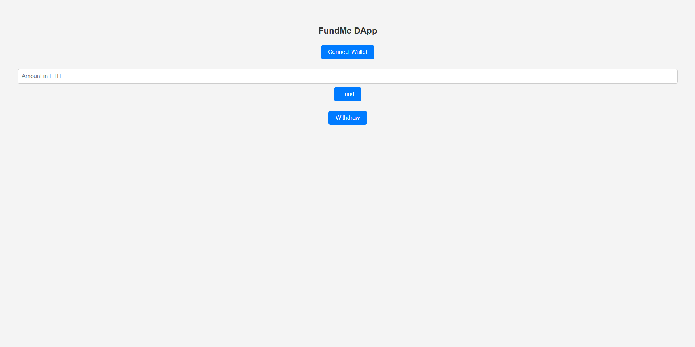

# 💰 FundMe DApp

A **decentralized crowdfunding DApp** that allows users to connect their wallet, fund a smart contract, and withdraw funds. Built using **React, ethers.js, and Web3Modal**.



---

## 🚀 Features

✅ Connect Wallet using MetaMask  
✅ Fund the smart contract with ETH  
✅ Withdraw funds if you are the contract owner  
✅ Modern and responsive UI  

---

## 🛠 Tech Stack

- **Frontend:** React, Vite, ethers.js, Web3Modal  
- **Smart Contract:** Solidity, Hardhat  
- **Blockchain:** Ethereum Testnet (Goerli, Sepolia, etc.)  

---

## 📦 Installation & Setup

### 1️⃣ Clone the Repository
```sh
git clone https://github.com/YOUR-USERNAME/FundMe-DApp.git
cd FundMe-DApp
